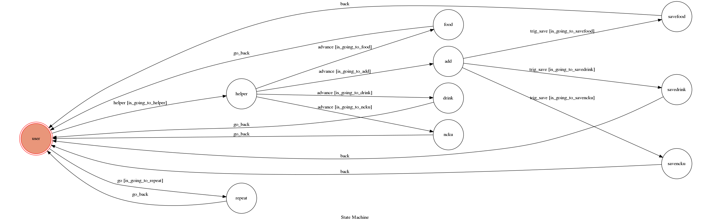

# What_To_Eat
toc project - line bot based on finite state machine

## Chat Bot 功能 :
```
* 正餐或飲料店家隨機產生  
* 新增自己喜歡的店家到資料庫內  
* 模仿你講話
```
# Quick start
## 店家產生  
```
1. 輸入 “小幫手”  
2. 選擇 午餐/晚餐、成大或者飲料  
3. bot隨機回傳資料庫中的一間店家  
```


## 新增店家至bot中
```
1.輸入 “小幫手”  
2.選擇 推薦店家給“吃吃”  
```


## 模仿你說話
```
1.你輸入的對話，回傳給你  
```


## Setup
```
* Python 3  
* Line app
* Google sheets api
```

## FSM Graph

